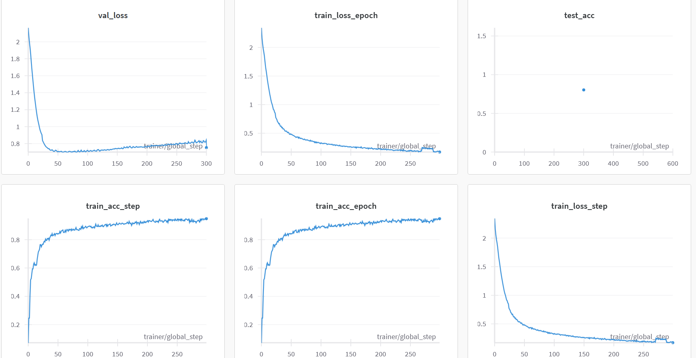
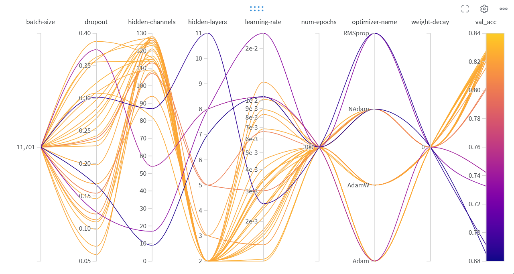
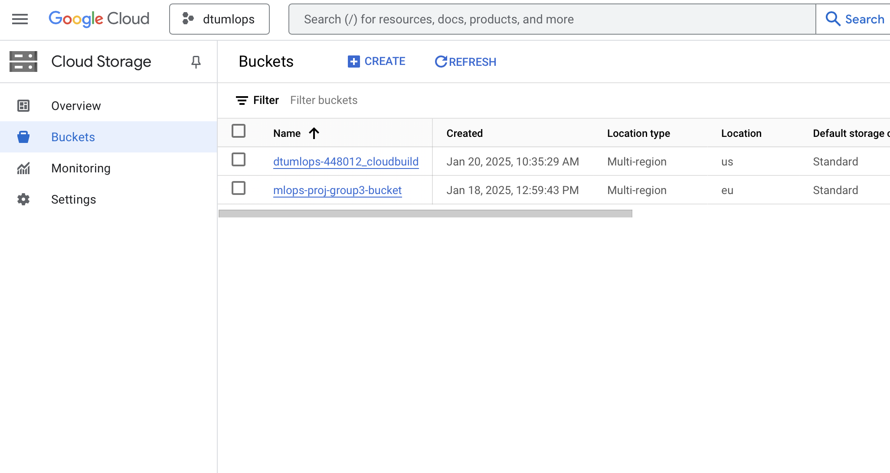
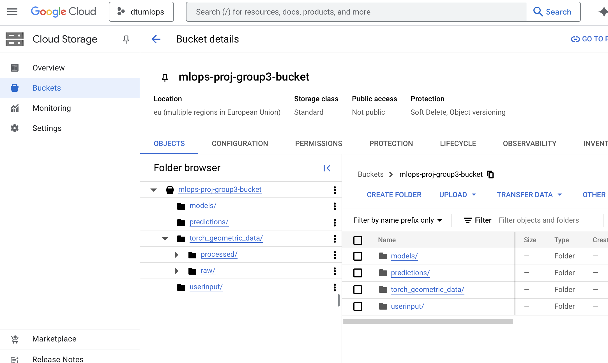
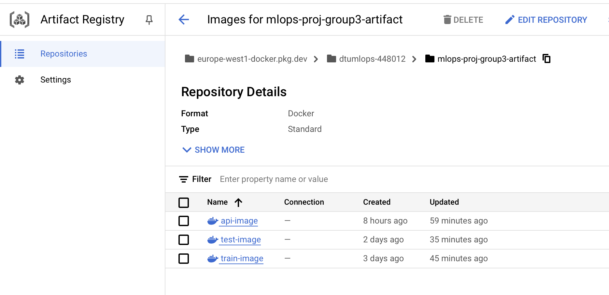

# Exam template for 02476 Machine Learning Operations

This is the report template for the exam. Please only remove the text formatted as with three dashes in front and behind
like:

```--- question 1 fill here ---```

Where you instead should add your answers. Any other changes may have unwanted consequences when your report is
auto-generated at the end of the course. For questions where you are asked to include images, start by adding the image
to the `figures` subfolder (please only use `.png`, `.jpg` or `.jpeg`) and then add the following code in your answer:

```markdown

```

In addition to this markdown file, we also provide the `report.py` script that provides two utility functions:

Running:

```bash
python report.py html
```

Will generate a `.html` page of your report. After the deadline for answering this template, we will auto-scrape
everything in this `reports` folder and then use this utility to generate a `.html` page that will be your serve
as your final hand-in.

Running

```bash
python report.py check
```

Will check your answers in this template against the constraints listed for each question e.g. is your answer too
short, too long, or have you included an image when asked. For both functions to work you mustn't rename anything.
The script has two dependencies that can be installed with

```bash
pip install typer markdown
```

## Overall project checklist

The checklist is *exhaustive* which means that it includes everything that you could do on the project included in the
curriculum in this course. Therefore, we do not expect at all that you have checked all boxes at the end of the project.
The parenthesis at the end indicates what module the bullet point is related to. Please be honest in your answers, we
will check the repositories and the code to verify your answers.

### Week 1

* [x] Create a git repository (M5)
* [x] Make sure that all team members have write access to the GitHub repository (M5)
* [x] Create a dedicated environment for you project to keep track of your packages (M2)
* [x] Create the initial file structure using cookiecutter with an appropriate template (M6)
* [x] Fill out the `data.py` file such that it downloads whatever data you need and preprocesses it (if necessary) (M6)
* [x] Add a model to `model.py` and a training procedure to `train.py` and get that running (M6)
* [x] Remember to fill out the `requirements.txt` and `requirements_dev.txt` file with whatever dependencies that you
    are using (M2+M6)
* [x] Remember to comply with good coding practices (`pep8`) while doing the project (M7)
* [ ] Do a bit of code typing and remember to document essential parts of your code (M7)
* [x] Setup version control for your data or part of your data (M8)
* [x] Add command line interfaces and project commands to your code where it makes sense (M9)
* [x] Construct one or multiple docker files for your code (M10)
* [x] Build the docker files locally and make sure they work as intended (M10)
* [x] Write one or multiple configurations files for your experiments (M11)
* [ ] Used Hydra to load the configurations and manage your hyperparameters (M11)
* [ ] Use profiling to optimize your code (M12)
* [x] Use logging to log important events in your code (M14)
* [x] Use Weights & Biases to log training progress and other important metrics/artifacts in your code (M14)
* [x] Consider running a hyperparameter optimization sweep (M14)
* [x] Use PyTorch-lightning (if applicable) to reduce the amount of boilerplate in your code (M15)

### Week 2

* [x] Write unit tests related to the data part of your code (M16)
* [x] Write unit tests related to model construction and or model training (M16)
* [ ] Calculate the code coverage (M16)
* [x] Get some continuous integration running on the GitHub repository (M17)
* [x] Add caching and multi-os/python/pytorch testing to your continuous integration (M17)
* [x] Add a linting step to your continuous integration (M17)
* [x] Add pre-commit hooks to your version control setup (M18)
* [ ] Add a continues workflow that triggers when data changes (M19)
* [x] Add a continues workflow that triggers when changes to the model registry is made (M19)
* [x] Create a data storage in GCP Bucket for your data and link this with your data version control setup (M21)
* [x] Create a trigger workflow for automatically building your docker images (M21)
* [x] Get your model training in GCP using either the Engine or Vertex AI (M21)
* [x] Create a FastAPI application that can do inference using your model (M22)
* [x] Deploy your model in GCP using either Functions or Run as the backend (M23)
* [x] Write API tests for your application and setup continues integration for these (M24)
* [ ] Load test your application (M24)
* [ ] Create a more specialized ML-deployment API using either ONNX or BentoML, or both (M25)
* [ ] Create a frontend for your API (M26)

### Week 3

* [ ] Check how robust your model is towards data drifting (M27)
* [ ] Deploy to the cloud a drift detection API (M27)
* [ ] Instrument your API with a couple of system metrics (M28)
* [ ] Setup cloud monitoring of your instrumented application (M28)
* [ ] Create one or more alert systems in GCP to alert you if your app is not behaving correctly (M28)
* [ ] If applicable, optimize the performance of your data loading using distributed data loading (M29)
* [ ] If applicable, optimize the performance of your training pipeline by using distributed training (M30)
* [ ] Play around with quantization, compilation and pruning for you trained models to increase inference speed (M31)

### Extra

* [ ] Write some documentation for your application (M32)
* [ ] Publish the documentation to GitHub Pages (M32)
* [x] Revisit your initial project description. Did the project turn out as you wanted?
* [x] Create an architectural diagram over your MLOps pipeline
* [ ] Make sure all group members have an understanding about all parts of the project
* [x] Uploaded all your code to GitHub

## Group information

### Question 1
> **Enter the group number you signed up on <learn.inside.dtu.dk>**
>
> Answer:

3

### Question 2
> **Enter the study number for each member in the group**
>
> Example:
>
> *sXXXXXX, sXXXXXX, sXXXXXX*
>
> Answer:

s204617, s204623, s204070, s204605, s194645

### Question 3
> **A requirement to the project is that you include a third-party package not covered in the course. What framework**
> **did you choose to work with and did it help you complete the project?**
>
> Recommended answer length: 100-200 words.
>
> Example:
> *We used the third-party framework ... in our project. We used functionality ... and functionality ... from the*
> *package to do ... and ... in our project*.
>
> Answer:

We used the Pytorch Geometric framework combined with Pytorch Lightning for creating the model and training the Graph Neural Network. We used PyG to both get the data and create the model architecture.
We chose to use PyG instead of other open source frameworks that are perhaps more developed like DAG, which is framework agnostic, because we assumed it would be well integrated with the other frameworks in the pytorch family like lightning.
We used the data set available in the framework: WikiCS. With this we used the Dataloader available in the PyG framework and fed it to the lightning trainer.

## Coding environment

> In the following section we are interested in learning more about you local development environment. This includes
> how you managed dependencies, the structure of your code and how you managed code quality.

### Question 4

> **Explain how you managed dependencies in your project? Explain the process a new team member would have to go**
> **through to get an exact copy of your environment.**
>
> Recommended answer length: 100-200 words
>
> Example:
> *We used ... for managing our dependencies. The list of dependencies was auto-generated using ... . To get a*
> *complete copy of our development environment, one would have to run the following commands*
>
> Answer:

We used the open source [UV package manager](https://astral.sh/) from astral to manage dependencies and python environments. It keeps track of dependencies, environment and python version through the uv.lock file and the pyproject.toml automatically. To get a complete copy of our environment one would have to run the following while in the directory containing the two files:
```bash
pip install uv \
uv sync
```
This would install uv initially and then uv sync would automatically look in the uv.lock file and pyproject.toml file for dependencies and python version. With this info it would initialize a virtual environment and install all the packages either from the local cache if available or the internet.

### Question 5

> **We expect that you initialized your project using the cookiecutter template. Explain the overall structure of your**
> **code. What did you fill out? Did you deviate from the template in some way?**
>
> Recommended answer length: 100-200 words
>
> Example:
> *From the cookiecutter template we have filled out the ... , ... and ... folder. We have removed the ... folder*
> *because we did not use any ... in our project. We have added an ... folder that contains ... for running our*
> *experiments.*
>
> Answer:

We filled out most of the cookiecutter template provided by the course but made some key deviations. Specifically, we created a new folder named \cloud for cloud build-related configurations, which wasn’t part of the original structure. The cloud folder was also used when testing the cloud integration locally by adding our service worker keys to it  and mounting it on the dockers images on runtime. Additionally, we left certain sections, such as \notebooks, unfilled as we did not use notebooks at all. We omitted using notebooks as they weren't necessary for what we were making and would have added overhead. 

### Question 6

> **Did you implement any rules for code quality and format? What about typing and documentation? Additionally,**
> **explain with your own words why these concepts matters in larger projects.**
>
> Recommended answer length: 100-200 words.
>
> Example:
> *We used ... for linting and ... for formatting. We also used ... for typing and ... for documentation. These*
> *concepts are important in larger projects because ... . For example, typing ...*
>
> Answer:

While we used Ruff for our linting it was not integrated to a wide enough extent. It was exclusively used in the precommit commands.
More explicit use would have been ideal for formating consistency. In a larger project this would have been vital. It is an important step for reproducability and readability espacially for larger projects where everyone has their own way of writing code. For example we can take the way to write functions and classes where you can easily distinguish between the two and gleen some function from them by the way they are written if consistent. Such consistency can be achieved with a good integration of Ruff.

## Version control

> In the following section we are interested in how version control was used in your project during development to
> corporate and increase the quality of your code.

### Question 7

> **How many tests did you implement and what are they testing in your code?**
>
> Recommended answer length: 50-100 words.
>
> Example:
> *In total we have implemented X tests. Primarily we are testing ... and ... as these the most critical parts of our*
> *application but also ... .*
>
> Answer:

We implemented a data test and a model test. They primarily test the shape of the input and the existance of certain functions in the model. The forward pass is tested in the model to ensure training is possible. 
???

### Question 8

> **What is the total code coverage (in percentage) of your code? If your code had a code coverage of 100% (or close**
> **to), would you still trust it to be error free? Explain you reasoning.**
>
> Recommended answer length: 100-200 words.
>
> Example:
> *The total code coverage of code is X%, which includes all our source code. We are far from 100% coverage of our **
> *code and even if we were then...*
>
> Answer:

--- question 8 fill here ---

### Question 9

> **Did you workflow include using branches and pull requests? If yes, explain how. If not, explain how branches and**
> **pull request can help improve version control.**
>
> Recommended answer length: 100-200 words.
>
> Example:
> *We made use of both branches and PRs in our project. In our group, each member had an branch that they worked on in*
> *addition to the main branch. To merge code we ...*
>
> Answer:

We heavily relied on branches for feature development. We created a new branch for each feature being developed and then once the feature was working it was merged into the main branch via a pull request. This helped to separate the work and ensure that there was always working code on the main branch (disregarding uncaught errors and build failures). All merges to main were made with PR's to check that all code passed the appropriate tests before being committed to main. Then when merge conflicts appeared we made sure to have at least one other developer to review the pull request before admitting it.

### Question 10

> **Did you use DVC for managing data in your project? If yes, then how did it improve your project to have version**
> **control of your data. If no, explain a case where it would be beneficial to have version control of your data.**
>
> Recommended answer length: 100-200 words.
>
> Example:
> *We did make use of DVC in the following way: ... . In the end it helped us in ... for controlling ... part of our*
> *pipeline*
>
> Answer:

During the project, we did not explicitly use DVC for data version control. Our workflow involved downloading the WikiCS dataset from Torch-Geometric and storing it in a bucket on Google Cloud Platform (GCP). By storing the data on GCP, we achieved a basic form of version control through the bucket's inherent capabilities. However, since our dataset was static and we did not anticipate any changes, we did not find the need to use DVC directly.
That said, using DVC could have been beneficial in cases where datasets are frequently updated or when experiments require tracking changes to datasets alongside code versions.

### Question 11

> **Discuss you continuous integration setup. What kind of continuous integration are you running (unittesting,**
> **linting, etc.)? Do you test multiple operating systems, Python  version etc. Do you make use of caching? Feel free**
> **to insert a link to one of your GitHub actions workflow.**
>
> Recommended answer length: 200-300 words.
>
> Example:
> *We have organized our continuous integration into 3 separate files: one for doing ..., one for running ... testing*
> *and one for running ... . In particular for our ..., we used ... .An example of a triggered workflow can be seen*
> *here: <weblink>*
>
> Answer:

For continuoues integration we have made 3 tests, which respectively tests the data structure, our model and the training of our model. The three tests are all included in the 'tests' folder. As the group members are using different operating systems and versions of python, we have set up the tests such that they run for both "ubuntu-latest" and "macos-latest", as well as a single version of python. This is reflected in the .github/workflows/tests.yaml file. 
To enforce good coding practices we have utilised ruff for linting in our pre-commit. Other pre-commits that ensure that uv.lock exists and prints a requirements.txt for anyone not wanting to use uv for dependencies these can be seen in the [pre-commit file](https://github.com/Fiehn/wiki-classification-mlops/blob/main/.pre-commit-config.yaml) with some custom actions added in the [uv-package-check.sh](https://github.com/Fiehn/wiki-classification-mlops/blob/main/uv-package-check.sh).
We attempted to make it standard practice to run pre-commit before any commit but there was nothing set up to enforce this.
We set up a trigger to build the test and train docker builds in GCP whenever there is a push to main along with this we set up continuous deployment of the api docker in cloud run again at a push to main.

An example of a triggered github action workflow can be seen on the main branch or by following the [link](https://github.com/Fiehn/wiki-classification-mlops/actions/runs/12935606205).

## Running code and tracking experiments

> In the following section we are interested in learning more about the experimental setup for running your code and
> especially the reproducibility of your experiments.

### Question 12

> **How did you configure experiments? Did you make use of config files? Explain with coding examples of how you would**
> **run a experiment.**
>
> Recommended answer length: 50-100 words.
>
> Example:
> *We used a simple argparser, that worked in the following way: Python  my_script.py --lr 1e-3 --batch_size 25*
>
> Answer:

We initially experimented manually with Typer and Invoke using the following structure:
```bash
uv run invoke train --lr 0.001 ...
```
This allowed us to easily change parameter values on the fly and everything was stored and recorded in Weights and Biases. We did not use a configuration framework other than when we use Weights and Biases in the next question.


### Question 13

> **Reproducibility of experiments are important. Related to the last question, how did you secure that no information**
> **is lost when running experiments and that your experiments are reproducible?**
>
> Recommended answer length: 100-200 words.
>
> Example:
> *We made use of config files. Whenever an experiment is run the following happens: ... . To reproduce an experiment*
> *one would have to do ...*
>
> Answer:

All experiments and test logged to Weights and Biases from the beginning, this includes the model as an artifact so reproducibility was always possible. This was done using the sweep.yaml file and the command:
```bash
uv run invoke sweep
```
To reproduce any experiment one would have to get the artifact model from W&B that corresponds to the specific run as metadata it contains all hyper parameters. This would then be downloaded and run.

Hyper parameter tuning was done using a sweep in W&B, this sweep used one split of the data and used Bayesian optimization to find the parameters that maximized validation accuracy.

### Question 14

> **Upload 1 to 3 screenshots that show the experiments that you have done in W&B (or another experiment tracking**
> **service of your choice). This may include loss graphs, logged images, hyperparameter sweeps etc. You can take**
> **inspiration from [this figure](figures/wandb.png). Explain what metrics you are tracking and why they are**
> **important.**
>
> Recommended answer length: 200-300 words + 1 to 3 screenshots.
>
> Example:
> *As seen in the first image when have tracked ... and ... which both inform us about ... in our experiments.*
> *As seen in the second image we are also tracking ... and ...*
>
> Answer:

```markdown

```

We have used W&B in our project for hyper parameter tuning using a sweep.yaml file as well as keeping track of key metrics of our model performance. First of all we are tracking the training accuracy, respectively over each epoch (train_acc_epoch) and during training at each step (train_acc_step). These statistics help us track how well the model is learning and help us diagnose potential issues like over- or underfitting. During the training we also measure the validation accuracy (val_acc), which provides an unbiased estimate of the model's performance on unseen data. Lastly we track the test accuracy, which serves as the final evaluation metric for the model's ability to generalize to entirely unseen data.

```markdown

```

The sweep was performed once on the first training split of the data (1/20 of the entire data) and used a Bayesian optimization to find the best hyper parameters for the validation accuracy. This is displayed in the image where the 30 runs can be seen. This sweep was made using GC's Vertex AI train functionality to not use local resources on the intensive sweep.
Other factors were also tracked during the hyper parameter tuning such as train and validation loss, training accuracy and a test score for unseen data.

### Question 15

> **Docker is an important tool for creating containerized applications. Explain how you used docker in your**
> **experiments/project? Include how you would run your docker images and include a link to one of your docker files.**
>
> Recommended answer length: 100-200 words.
>
> Example:
> *For our project we developed several images: one for training, inference and deployment. For example to run the*
> *training docker image: `docker run trainer:latest lr=1e-3 batch_size=64`. Link to docker file: <weblink>*
>
> Answer:

For our project, we have developed three images, one for [training](https://github.com/Fiehn/wiki-classification-mlops/blob/main/dockerfiles/train.dockerfile), one for [testing](https://github.com/Fiehn/wiki-classification-mlops/blob/main/dockerfiles/test.dockerfile) and one for [API](https://github.com/Fiehn/wiki-classification-mlops/blob/main/dockerfiles/api.dockerfile) calls to inference. These images are built on GCP via cloud build triggers, ensuring portability and scalability. The cloudbuild file can be seen in [/cloud/cloudbuild.yaml](https://github.com/Fiehn/wiki-classification-mlops/blob/main/cloud/cloudbuild.yaml), and the dockerfiles are as expected in the folder /dockerfiles/. The train dockers were run using Vertex AI train building from the train dockerfile.

To build locally for testing that the containers work we use a command like the following:
```bash
docker build dockerfiles/train.dockerfile
```

Using dockers simplified our workflow by avoiding the need to manually configure the environment on different machines. Instead, the container ensures consistency across deployments by packaging all dependencies, libraries, and code. Then using the cloud build triggers ensured that the dockers we used in the cloud was always the latest working build.

### Question 16

> **When running into bugs while trying to run your experiments, how did you perform debugging? Additionally, did you**
> **try to profile your code or do you think it is already perfect?**
>
> Recommended answer length: 100-200 words.
>
> Example:
> *Debugging method was dependent on group member. Some just used ... and others used ... . We did a single profiling*
> *run of our main code at some point that showed ...*
>
> Answer:

The group mostly debugged using the standard python debugger in Visual Studio Code, this was done by liberally using breakpoints and observing the local memory. Along with this a lot of the debugging was done in relation to the integration with GC for this traditional debugging was not applicable so we used a mix of generative ai and the documentation to understand the problems we encountered.

We did not profile our code to any major extent or use any of the tools discussed in the course, the reason we did this was time constraints involved in fixing anything we received from the profiling. Furthermore, we deemed that the version of the code we had running was relatively fast for the use case.
This would of course in a larger or longer project not have been the case.

## Working in the cloud

> In the following section we would like to know more about your experience when developing in the cloud.

### Question 17

> **List all the GCP services that you made use of in your project and shortly explain what each service does?**
>
> Recommended answer length: 50-200 words.
>
> Example:
> *We used the following two services: Engine and Bucket. Engine is used for... and Bucket is used for...*
>
> Answer:

For the project, we have used the following GCP services:
* Bucket: is used as our cloud storage solution. Both our raw and proceseed data is therefore found in the bucket: mlops-proj-group3-bucket/torch_geometric_data
* Artifact: is used for centralising and managing our repository, e.g. our docker images: europe-west1-docker.pkg.dev/dtumlops-448012/mlops-proj-group3-artifact
* Compute engine: 


### Question 18

> **The backbone of GCP is the Compute engine. Explained how you made use of this service and what type of VMs**
> **you used?**
>
> Recommended answer length: 100-200 words.
>
> Example:
> *We used the compute engine to run our ... . We used instances with the following hardware: ... and we started the*
> *using a custom container: ...*
>
> Answer:

We did not use Google Cloud Platform's Compute Engine directly for our model training. Instead, we used the platform Vertex AI, making use of its advanced capabilities such as its built-in feature of managing and optimizing compute instances by automatically turning them on and off as needed. This feature made it easier to economize with our limited allocated compute resources. Consequently, Vertex AI proved useful for training our model. For the deployment phase, we used GCP's Cloud Run, a serverless compute platform, for hosting and running our application in simulated production. In terms of hardware, we used the general-purpose machine type n1-standard-4, and a single GPU for NVIDIA tesla T4 for training. Both the training and API were started by making use custom docker images. 

### Question 19

> **Insert 1-2 images of your GCP bucket, such that we can see what data you have stored in it.**
> **You can take inspiration from [this figure](figures/bucket.png).**
>
> Answer:

```markdown

```

```markdown

```

The first of the above screenshot displays the cloud storage of our project, while the second shows what our project bucket contains. The 'model' folder contain the best model per split as well as the best overall model (across splits). The two folders 'Prediction' and 'Userinput' are a result of our API, such that for each API call the associated user input and the final predictions were saved respectively. The last folder 'torch_geometric_data' contains our source data, both raw and processed.

### Question 20

> **Upload 1-2 images of your GCP artifact registry, such that we can see the different docker images that you have**
> **stored. You can take inspiration from [this figure](figures/registry.png).**
>
> Answer:

```markdown

```

The above image shows our three docker images, one for api, test and train respectively. As mentioned in question 15 utilising the dockerfiles ensures portability and scalability.

### Question 21

> **Upload 1-2 images of your GCP cloud build history, so we can see the history of the images that have been build in**
> **your project. You can take inspiration from [this figure](figures/build.png).**
>
> Answer:

!! INSERT PICTURE !!!

```markdown

```

[This figure](figures/cloud_build.png) shows our GCP cloud build history. As seen there are many builds, some successful and some not The snapshot captures the iterative process of building and refining very well, as the failed attempts guided us toward improvements.

### Question 22

> **Did you manage to train your model in the cloud using either the Engine or Vertex AI? If yes, explain how you did**
> **it. If not, describe why.**
>
> Recommended answer length: 100-200 words.
>
> Example:
> *We managed to train our model in the cloud using the Engine. We did this by ... . The reason we choose the Engine*
> *was because ...*
>
> Answer:

We managed to train our model in the cloud using the vertex ai train functionality. We did this by creating a self contained docker that had all the nescesary files to train and then spun that docker up in the training environment.
In the environemnt it would get the files from our data bucket and deposit logs to Weights and Biases through the GC secret manager and deposit all the trained models into another bucket while simultaniously always keeping track of the best model to date by validation accuracy. 
With this we also managed to run the hyper parameter W&B sweep on our model and find the best parameters.

## Deployment

### Question 23

> **Did you manage to write an API for your model? If yes, explain how you did it and if you did anything special. If**
> **not, explain how you would do it.**
>
> Recommended answer length: 100-200 words.
>
> Example:
> *We did manage to write an API for our model. We used FastAPI to do this. We did this by ... . We also added ...*
> *to the API to make it more ...*
>
> Answer:

We managed to write and implement an API using FastAPI for inference with our current best model.
We did this by downloading the best model from the Cloud Bucket along with its hyperparameters, then loading the model into the architecture in model.py we run the input data sent by the request through the model to get a prediction, this prediction is returned to the user.
This input data is then sent to a userdata bucket in the the cloud for use in datadrifting monitoring and for future training.
The predictions are not stored anywhere, however this would be beneficial to be able to measure how the model performs on data, especially when the model can change while deployed.

We also added continous integration to our API making it automatically deploy a new docker in cloud run whenever there is a push to the main branch of the repository, this ensures that the code is always up to date.

### Question 24

> **Did you manage to deploy your API, either in locally or cloud? If not, describe why. If yes, describe how and**
> **preferably how you invoke your deployed service?**
>
> Recommended answer length: 100-200 words.
>
> Example:
> *For deployment we wrapped our model into application using ... . We first tried locally serving the model, which*
> *worked. Afterwards we deployed it in the cloud, using ... . To invoke the service an user would call*
> *`curl -X POST -F "file=@file.json"<weburl>`*
>
> Answer:

For deployment we wrapped our model into application using [FastAPI](https://fastapi.tiangolo.com). We constructed an API which imitates inference using our trianed model. Once the API is active, the user who is interacting with the API prompts $x$ and  $edge\_index$, to which the predicted class is returned. Firstly, we tried this out locally first by activating the API, and running the script [api_user_input_test.py](https://github.com/Fiehn/wiki-classification-mlops/blob/main/src/wikipedia/api_user_input_test.py) to simulate a plausible user input. Afterwards, the API was deployed in the cloud using a Cloud Build Trigger through Cloud Run which automatically deployed the latest api docker image ([api.dockerfile](https://github.com/Fiehn/wiki-classification-mlops/blob/main/dockerfiles/api.dockerfile)) every time we pushed to the main branch. 

### Question 25

> **Did you perform any unit testing and load testing of your API? If yes, explain how you did it and what results for**
> **the load testing did you get. If not, explain how you would do it.**
>
> Recommended answer length: 100-200 words.
>
> Example:
> *For unit testing we used ... and for load testing we used ... . The results of the load testing showed that ...*
> *before the service crashed.*
>
> Answer:

--- question 25 fill here ---

### Question 26

> **Did you manage to implement monitoring of your deployed model? If yes, explain how it works. If not, explain how**
> **monitoring would help the longevity of your application.**
>
> Recommended answer length: 100-200 words.
>
> Example:
> *We did not manage to implement monitoring. We would like to have monitoring implemented such that over time we could*
> *measure ... and ... that would inform us about this ... behaviour of our application.*
>
> Answer:

--- question 26 fill here ---

## Overall discussion of project

> In the following section we would like you to think about the general structure of your project.

### Question 27

> **How many credits did you end up using during the project and what service was most expensive? In general what do**
> **you think about working in the cloud?**
>
> Recommended answer length: 100-200 words.
>
> Example:
> *Group member 1 used ..., Group member 2 used ..., in total ... credits was spend during development. The service*
> *costing the most was ... due to ... . Working in the cloud was ...*
>
> Answer:

The first 50$ credit was spent early in the process as a compute engine was left running overnight with a GPU attached. Then after we switched to using vertex ai for the training process such mistakes could not occur any longer. 
From the next 50$ credits we spent ??? over the remaining process, a very small part was spent on storage while the majority was spent training using a GPU and docker builds.
We ended up building a lot of docker containers due to the trigger automatically building at changes in the main branch and a lot of small build errors leading to rebuilding.

However it was a very small amount of credit used in total comparatively. This was mainly due to the short training times.

### Question 28

> **Did you implement anything extra in your project that is not covered by other questions? Maybe you implemented**
> **a frontend for your API, use extra version control features, a drift detection service, a kubernetes cluster etc.**
> **If yes, explain what you did and why.**
>
> Recommended answer length: 0-200 words.
>
> Example:
> *We implemented a frontend for our API. We did this because we wanted to show the user ... . The frontend was*
> *implemented using ...*
>
> Answer:

We implemented a driftreport script that could generate a datadrift report as a html from all inputted user data in the inference API.

### Question 29

> **Include a figure that describes the overall architecture of your system and what services that you make use of.**
> **You can take inspiration from [this figure](figures/overview.png). Additionally, in your own words, explain the**
> **overall steps in figure.**
>
> Recommended answer length: 200-400 words
>
> Example:
>
> *The starting point of the diagram is our local setup, where we integrated ... and ... and ... into our code.*
> *Whenever we commit code and push to GitHub, it auto triggers ... and ... . From there the diagram shows ...*
>
> Answer:

[This diagram](figures/projectOverview.png) illustrates the overall setup for our project. It takes its starting point in the most right part of the diagram, with the three pytorch boxes (lightning, geometric and codebase). This part represents the actual development of code (data, model and train) using our third-party package. While building the project codebase, we utilized UV to manage dependencies. Using UV, all necessary Python packages were added to a requirements.txt file, ensuring that the project environment could be reproduced consistently across team members' systems and cloud environments. To further enhance reproducibility, we containerized the environment. Docker images were created for both training and testing workflows. These images encapsulate all dependencies, configurations, and the codebase, providing a consistent runtime environment irrespective of the underlying infrastructure.

**Version Control and Quality tests**
To enforce collaboration and code quality Git and GitHub were employed for version control. These tools allowed multiple team members to work in parallel on different features using branches and pull requests. GitHub also served as the central repository for the entire project. Pytest was implemented to test and validate the codebase. Automated tests ensured that new features or changes did not break existing functionality. For checking our code, we implemented some workflows using git and pytest. 

**Data**
Initially, the WikiCS dataset was downloaded locally. To improve data versioning and accessibility, we uploaded the dataset to Google Cloud Storage (GCS). From this point onward, all models and training workflows relied on the cloud-stored dataset, ensuring consistent and centralized access to the data. When storing the data in the cloud, versions of the data are automatically tracked, and since we didn't expect any changes to our data, we didn't add DVC explicitly. However as seen on the diagram, it would have happened there.

Moving beyond local development, we integrated several cloud-based services to streamline training, deployment, and monitoring processes. As mentioned we used GCS to host the dataset and trained models. We moreover used Google Artifact Registry to store the Docker images created during development. These images were used for cloud-based training and running our sweeps for hyperparameter tuning. Finally we used vertex AI as the primary platform for training and deploying machine learning models. After training, the models were uploaded to Vertex AI for use in production.

Weights and Biases (Wandb) were used in parallel to the training, logging all relevant performance metrics. Question 14 displays some of the logged performances. 

Finally, FastAPI was implemented to enable users to input data into our model and receive predictions based on the best-performing version. To keep track of potential changes in the user input, Evidently AI was implemented. Evidently AI created a local report, comparing the user input to the original data stored in GC cloud storage. 

### Question 30

> **Discuss the overall struggles of the project. Where did you spend most time and what did you do to overcome these**
> **challenges?**
>
> Recommended answer length: 200-400 words.
>
> Example:
> *The biggest challenges in the project was using ... tool to do ... . The reason for this was ...*
>
> Answer:

During the project, setting up GCP and making everything work seamlessly in the cloud has by far taken up most of our time. 
The issues were mostly related to making the docker environment have all the nescesary permissions, secrets and files when running in the vertex ai trainer.
We could make most things work on our local docker with the same service accounts but once it reached the cloud it struggled doing the same things, mostly due to permissions.

However once we figured everything out with the right permission, service account and credentials, it worked very well and we therefore managed to do all of our training and hyperparameter tuning in the cloud.

Another hurdle in the project occured in the beginning where Pytorch Geometric had very poor documentation regrading the dataset we were using and the dataclasses. This led to some inconsistencies when combining the framework with Pytorch Lightning which we wanted to use.
Solving this took time and led to using the already implemented function for storing and handling the specific dataset (WikiCS) instead of creating our own which we wanted for the additional control.


### Question 31

> **State the individual contributions of each team member. This is required information from DTU, because we need to**
> **make sure all members contributed actively to the project. Additionally, state if/how you have used generative AI**
> **tools in your project.**
>
> Recommended answer length: 50-300 words.
>
> Example:
> *Student sXXXXXX was in charge of developing of setting up the initial cookie cutter project and developing of the*
> *docker containers for training our applications.*
> *Student sXXXXXX was in charge of training our models in the cloud and deploying them afterwards.*
> *All members contributed to code by...*
> *We have used ChatGPT to help debug our code. Additionally, we used GitHub Copilot to help write some of our code.*
> Answer:


Student s204617 and s204623 was in charge of setting up the inital cookie cutter project and github repository, as well as developing the docker container (in the cloud) for training our application. 
Student s204617 has been in charge of setting up the overall workflow and tests, while all other members have contributed with more specific tests and checks.
Students s204070 and s204617 building the structure of our data.py, train.py and model.py. The others have helped out, but majority of the work was done by the two first mentioned students. s204070 did an overhaul to make the train more modular and loading data using best practice based on other papers and optimising the hyperparameters with a wandb sweep. 
Student s204070 has made the tasks.py to create invoke commands for everything.
Student s204070 has set up W&B with help from s204605. Together they have been in charge of the tracking of the training and testing (including datastatistics.py, visualization.py, configurations and docker image of test). 
Student 204605 has been in charge of implementing Evidently AI.
Student s204617 and s204623 has been in charge of GCP. 
Student s204617, s204623 and s194645 has been in charge of API.

We have used ChatGPT to help debug our code. Additionally, we used GitHub Copilot to help write some of our code.
All members have contributed to the project and writing the report. Overall it has been a collaborative process making the project.
